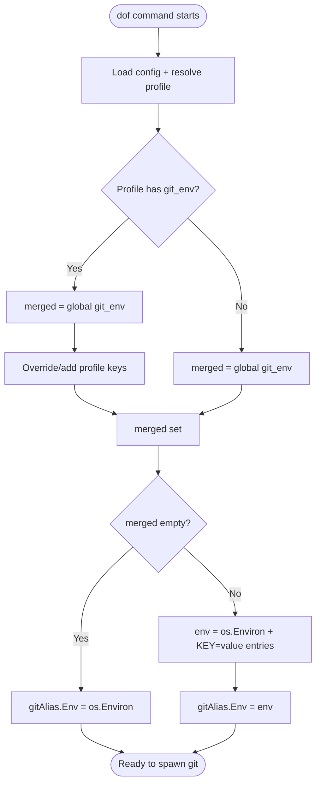
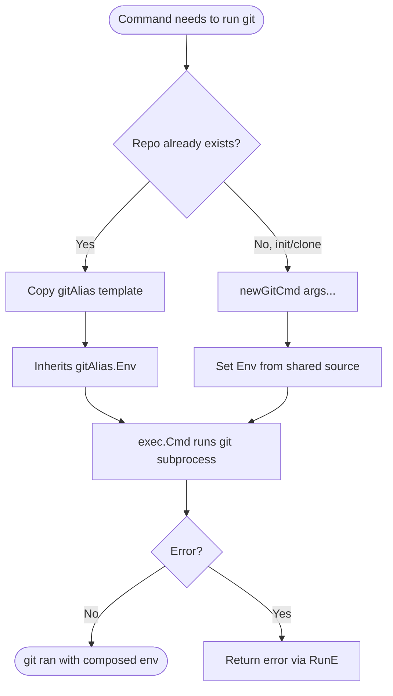

# Design – dof (dotfile repository tool)

## 1. Architecture Overview

```text
┌────────────┐
│   main.go  │  entry point – calls cmd.Execute()
└─────┬──────┘
      │
      ▼
┌────────────────────────────────────────────────┐
│                   cmd/ package                 │
│                                                │
│  root.go      – cobra root command, viper cfg  │
│  init.go      – dof init                       │
│  checkout.go  – dof checkout                   │
│  add.go       – dof add                        │
│  sync.go      – dof sync                       │
│  status.go    – dof status                     │
│  alias.go     – dof alias (pass-through)       │
│  completion.go– shell completions              │
│  version.go   – version info                   │
│  release.go   – build-tag gated build metadata │
│  exec.go      – git command execution helpers  │
│  logger.go    – custom logrus wrapper          │
└────────────────────────────────────────────────┘
        │
        │  os/exec
        ▼
   ┌──────────┐
   │   git    │  system git binary
   └──────────┘
```

All commands shell out to the locally installed `git` binary via
`os/exec`. The bare repository lives at a configurable path (default
`$HOME/.dof`) and the work tree is the parent directory of that path
(typically `$HOME`).

## 2. Project Structure

```text
dof/
├── main.go                  # entry point
├── go.mod / go.sum
├── cmd/
│   ├── root.go              # cobra root, viper init
│   ├── init.go              # init command
│   ├── checkout.go          # checkout command
│   ├── add.go               # add command
│   ├── sync.go              # sync command
│   ├── status.go            # status command
│   ├── alias.go             # alias (pass-through) command
│   ├── completion.go        # shell completion
│   ├── version.go           # version command
│   ├── release.go           # build time (release tag only)
│   ├── exec.go              # helpers: execCmdAndPrint, execCmdAndReturn, doWePanic
│   └── logger.go            # Logger struct wrapping logrus
├── .goreleaser.yaml         # GoReleaser config
├── .github/
│   └── workflows/
│       ├── go-test.yml      # CI – go test
│       ├── release.yml      # semantic-release + goreleaser
│       └── codeql-analysis.yml
├── renovate.json            # Renovate dependency updates
├── spec/                    # spec-driven docs
│   ├── requirements.md
│   ├── design.md
│   └── tasks.md
└── README.adoc
```

## 3. Technology Stack

| Concern              | Choice                            | Rationale                                          |
|----------------------|-----------------------------------|----------------------------------------------------|
| Language             | Go 1.26                           | Existing project language                          |
| CLI framework        | spf13/cobra                       | De-facto standard for Go CLIs                      |
| Configuration        | spf13/viper                       | Seamless flag / env / file config binding          |
| Logging              | sirupsen/logrus (custom wrapper)  | Already in use; provides structured logging        |
| Git interaction      | os/exec → system `git`            | No cgo; leverages user's existing git installation |
| Build / Release      | GoReleaser + go-semantic-release  | Automated versioning, cross-compile, Homebrew tap  |
| CI                   | GitHub Actions                    | go-test, CodeQL, release workflows                 |
| Dependency updates   | Renovate                          | Automated PRs for Go modules & GH Actions          |

## 4. Configuration Management

Configuration is managed by **viper** with the following precedence
(highest → lowest):

1. CLI flags (`--repository`, `--branch`, `--config`)
2. Environment variables (`DOF_REPOSITORY`, `DOF_BRANCH`)
3. Config file (`$HOME/.dof.yaml`)
4. Defaults (`repository=$HOME/.dof`, `branch=main`)

On every successful run the merged config is written back to the YAML
file via `viper.WriteConfig()`.

### 4.1 Skip Files (Sparse Checkout)

The `skip_files` option is a list of file paths to exclude from the
working tree. It maps to git's sparse-checkout feature in non-cone
(pattern) mode.

**Config example (`$HOME/.dof.yaml`):**

```yaml
repository: /home/user/.dof
branch: main
skip_files:
  - README.md
  - LICENSE
  - scm-info.yaml

profiles:
  work:
    repository: /home/user/.dof-work
    skip_files:
      - README.adoc
```

**Implementation:** A helper function `applySkipFiles()` in `init.go`:

1. Reads `skip_files` from viper (string slice, default empty).
2. If the list is empty, disables sparse-checkout and returns.
3. Enables sparse-checkout in non-cone mode.
4. Writes patterns: `/*` (include all) followed by `!<file>` for each
   entry.
5. Runs `git read-tree -mu HEAD` to apply the rules to the working
   tree.

This function is called at the end of `dof init` and `dof checkout`.
Once set, git pull/merge automatically respects sparse-checkout rules,
so `dof sync` needs no extra logic.

### 4.2 Git Environment Variables (`git_env`)

The `git_env` option is a map of environment variable name → value
that is applied to every git process dof spawns (REQ-14).

**Config example (`$HOME/.dof.yaml`):**

```yaml
repository: /home/user/.dof
branch: main
git_env:
  GIT_CONFIG_GLOBAL: ~/.gitconfig
  GIT_SSH_COMMAND: ssh -i ~/.ssh/dof_key

profiles:
  work:
    repository: /home/user/.dof-work
    git_env:
      GIT_CONFIG_GLOBAL: ~/.gitconfig_work
```

**Merge rules:** In `applyProfile()` (`root.go`), the global `git_env`
map is merged with the selected profile's `git_env`. Profile values
win per key; keys present only in the global map are kept. The merged
map is written back via `viper.Set("git_env", merged)`.

**Application:** In `initFlags()`, the merged environment is built once:

1. Start from `os.Environ()` (the inherited OS environment).
2. Append each `git_env` entry as `KEY=value` (later entries override
   earlier ones for duplicate keys).
3. Assign the slice to `gitAlias.Env`.

Values are passed verbatim — dof performs no `~` or `$VAR` expansion;
git expands `~` in paths such as `GIT_CONFIG_GLOBAL` itself.

**Coverage:** Commands that copy `gitAlias` inherit `Env` automatically.
The two standalone commands (`git init --bare`, `git clone --bare`) are
built with the `newGitCmd()` helper so they also receive the same
environment (see §5.1). When `git_env` is empty, `gitAlias.Env` equals
the unmodified `os.Environ()`.

## 5. Git Command Execution

A global `*exec.Cmd` template (`gitAlias`) is built once during flag
initialisation:

```text
git --git-dir=<repo-path> --work-tree=<work-dir>
```

Each command copies this template, appends its specific arguments, and
calls one of:

- `execCmdAndPrint(cmd)` – runs the command, prints stdout/stderr, panics on error.
- `execCmdAndReturn(cmd)` – runs the command and returns stdout as a string.

### 5.1 Environment injection (`git_env`)

The `gitAlias` template has its `Env` field set once in `initFlags()`
to `os.Environ()` plus the configured `git_env` entries (see §4.2), so
every command that copies the template inherits the environment.

Two commands cannot use the template because they act on a repository
that does not yet exist:

- `git init --bare <repo>` in `init.go` — creates the bare repo; the
  template presupposes an existing `--git-dir`.
- `git clone --bare <url> <repo>` in `checkout.go` — creates the repo
  from a remote URL.

To honour "every git invocation", these standalone commands are built
via a helper `newGitCmd(args ...string) *exec.Cmd` that returns an
`*exec.Cmd` with `Env` already populated the same way. Environment
composition therefore lives in exactly two places — `gitAlias.Env`
(set once in `initFlags()`) and `newGitCmd()` — so the `execCmd*`
helpers do not touch `Env`.

## 6. Error Handling Strategy

Currently a simple `doWePanic(err)` helper calls `logger.Fatal(err)`
(which calls `os.Exit(1)`) on any non-nil error. This is acceptable
for a CLI tool but could be improved by returning errors up the call
chain and letting cobra handle exit codes.

## 7. Security Considerations

- No secrets are stored in code; tokens (`GITHUB_TOKEN`,
  `HOMEBREW_TAP_GITHUB_TOKEN`) are injected via GitHub Actions secrets.
- The repo directory is created with mode `0700`.
- The tool passes user-supplied arguments to `git` via `os/exec`
  (not through a shell), which avoids shell injection.
- CodeQL analysis runs weekly and on every PR.

## 8. Build & Release

- **GoReleaser** builds for linux, windows, darwin (all with
  `CGO_ENABLED=0`).
- The `release` build tag injects `buildTime` via `cmd/release.go`.
- Version is injected via ldflags: `-X cmd.version={{.Version}}`.
- A Homebrew formula is pushed to `steffakasid/homebrew-dof`.
- Release is triggered on a monthly schedule via `go-semantic-release`.

## 9. Detailed Specification – REQ-14 `git_env`

### 9.1 Use Case: Apply configured environment to git

- **Trigger:** The user runs any dof command that shells out to git
  (`init`, `checkout`, `add`, `sync`, `status`, `alias`).
- **Preconditions:** A config file exists (or defaults apply); the
  active profile is resolved.
- **Main Flow:**
  1. dof loads config and resolves the active profile.
  2. `applyProfile()` merges global and profile `git_env` (profile wins
     per key).
  3. `initFlags()` builds the environment: `os.Environ()` + merged
     `git_env` entries as `KEY=value`.
  4. The environment slice is assigned to `gitAlias.Env`.
  5. When the command spawns git — via a copy of `gitAlias` or via
     `newGitCmd()` — the process runs with the composed environment.
- **Alternative Flows:**
  - **A1 `git_env` empty:** No entries are appended; `gitAlias.Env`
    equals `os.Environ()`. git runs with the unmodified environment.
  - **A2 Key in both global and profile:** The profile value replaces
    the global value for that key before the slice is built.
  - **A3 Standalone command (`init`/`clone`):** The command is created
    with `newGitCmd()`, which sets the same `Env`, so it is covered even
    though it does not copy `gitAlias`. Environment composition lives
    only in `gitAlias.Env` and `newGitCmd()`; the `execCmd*` helpers do
    not modify `Env`.
- **Postconditions:** Every git subprocess for the invocation inherits
  the OS environment plus the configured overrides. No dof-side value
  expansion is performed.
- **Business Rules:**
  - BR1: `git_env` is configured only in the config file (global and
    per profile). No CLI flag or `DOF_` env override exists.
  - BR2: Profile values win over global values per key; other global
    keys are merged in.
  - BR3: Values are used verbatim (no `~`/`$VAR` expansion by dof).
  - BR4: The environment is additive over `os.Environ()` — only
    additions/overrides are listed.
  - BR5: Applies to every git invocation regardless of necessity.

### 9.2 Activity Diagram – environment composition



### 9.3 Activity Diagram – git invocation coverage



### 9.4 Acceptance Criteria (Gherkin)

```gherkin
Feature: Configurable environment variables for git execution

  Background:
    Given a dof config file exists

  Scenario: git_env from global config is applied
    Given the config sets git_env "GIT_CONFIG_GLOBAL" to "~/.gitconfig"
    When dof runs any command that executes git
    Then the git subprocess environment contains "GIT_CONFIG_GLOBAL=~/.gitconfig"
    And the git subprocess still inherits the existing OS environment

  Scenario: empty git_env leaves the environment unchanged
    Given the config defines no git_env entries
    When dof runs any command that executes git
    Then the git subprocess environment equals the inherited OS environment

  Scenario: profile value overrides global value per key
    Given the global config sets git_env "GIT_CONFIG_GLOBAL" to "~/.gitconfig"
    And profile "work" sets git_env "GIT_CONFIG_GLOBAL" to "~/.gitconfig_work"
    When dof runs with profile "work"
    Then the git subprocess environment contains "GIT_CONFIG_GLOBAL=~/.gitconfig_work"

  Scenario: global-only keys are merged into the profile environment
    Given the global config sets git_env "GIT_SSH_COMMAND" to "ssh -i ~/.ssh/id"
    And profile "work" sets git_env "GIT_CONFIG_GLOBAL" to "~/.gitconfig_work"
    When dof runs with profile "work"
    Then the git subprocess environment contains "GIT_SSH_COMMAND=ssh -i ~/.ssh/id"
    And the git subprocess environment contains "GIT_CONFIG_GLOBAL=~/.gitconfig_work"

  Scenario: values are passed verbatim without expansion
    Given the config sets git_env "GIT_CONFIG_GLOBAL" to "~/.gitconfig"
    When dof runs any command that executes git
    Then the value "~/.gitconfig" is passed to git without dof expanding "~"

  Scenario: standalone init command receives git_env
    Given the config sets git_env "GIT_CONFIG_GLOBAL" to "~/.gitconfig"
    When dof runs "dof init"
    Then the "git init --bare" subprocess environment contains "GIT_CONFIG_GLOBAL=~/.gitconfig"

  Scenario: standalone checkout clone receives git_env
    Given the config sets git_env "GIT_CONFIG_GLOBAL" to "~/.gitconfig"
    When dof runs "dof checkout <url>"
    Then the "git clone --bare" subprocess environment contains "GIT_CONFIG_GLOBAL=~/.gitconfig"
```
